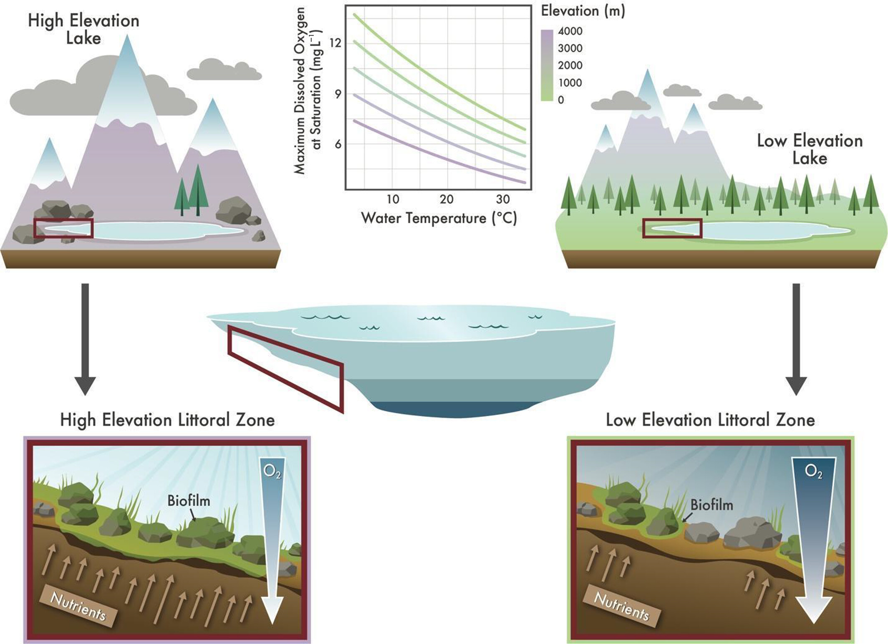

# MLBG 
This is the repository for the Mountain Lake Benthic Greening project.
Alpine lakes are experiencing increasing algal blooms. These blooms are often 
associated with increased human development which often leads to increased 
nutrient inputs. However, even oligotrophic lakes that are isolated from humans
are experiencing increased benthic blooming. One possible explanation for this 
is that rapid warming of the littoral zone in these lakes may be causing a 
positive feedback loop which causes greater warming, anoxia, and anaerobic 
mechanisms which release nutrients near the benthos, thus feeding algal blooms. 
Given that lakes at higher elevation already have lower O2 holding capacities, 
this may occur at lower temperatures than lakes closer to sea level. A graphic 
of this hypothesis (figure 1) is under “Additional Materials”. However, more 
work needs to be done to verify this hypothesis. 

## What has been done?
Stephanie and others have published a paper discussing this [potential 
mechanisms](https://aslopubs.onlinelibrary.wiley.com/doi/full/10.1002/lol2.10357). 
Beyond that, we have also been figuring out ways to sample these lake sediments
to detect these shifts in redox conditions. Stephanie has tried 
using silver wire, which would have presented a system which can be easily 
deployed in the field, but this didn’t work. Another system which shows 
promise is a “field Lysimeter” which can be used to gently pull water out 
from sediment for measurement. Other systems we have also been looking into is 
the unisense probe and DGT samplers.
	
## What needs to be done?
As of the last update, we are planning on doing further testing of the field 
Lysimeters and potentially trying out the DGT samplers. The goal is to be able 
to create a sampling plan that would allow us to measure changes in redox 
potential by taking measurements in the evening and mornings. Doing this across
alpine and non-alpine lakes, in combination with temperature data, should allow
us to test the hypothesis that these lakes are experiencing anoxia at lower
temperatures than other lakes. Beyond that, this project also has the
opportunity to grow!

## Additional Materials

Figure 1: Conceptual model of nearshore periphyton blooming caused by rapid
warming of the littoral zone.

